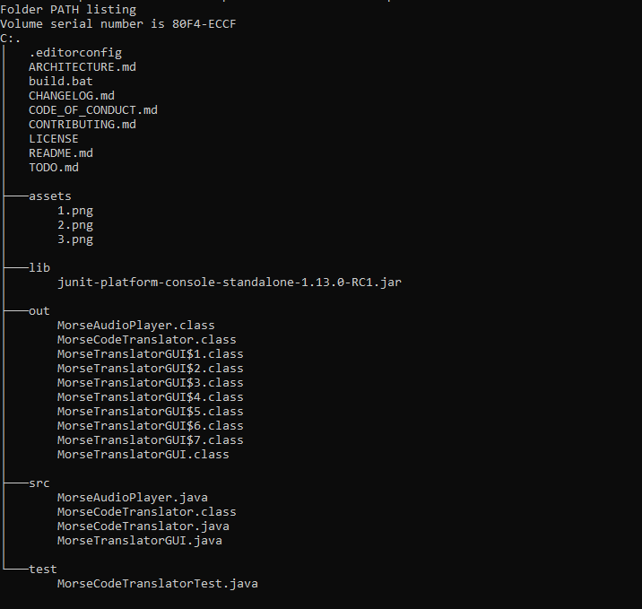

# R2-D2 Morse Code Translator

A command-line and GUI application designed to translate human language to Morse code and vice-versa, specifically crafted for R2-D2's galactic communications needs.

## Project Structure

Understanding the layout of the project can help with navigation and contribution.



---

## About the Project

This project aims to provide a reliable and easy-to-use tool for converting text into Morse code signals and decoding Morse back into human-readable text. It was developed with a focus on clear functionality and an intuitive user interface, resembling a console from a galaxy far, far away.

## Features

- **Text to Morse Translation:** Convert any English text into its corresponding Morse code representation.
- **Morse to Text Translation:** Decode Morse code sequences back into human-readable English text.
- **Intuitive GUI:** A custom-themed graphical user interface for easy interaction, designed with a "Galactic Console" aesthetic.
- **Morse Audio Playback:** Listen to the translated Morse code with adjustable speed, bringing the communication to life!

---

...

## Screenshots

Here are some visual examples of the R2-D2 Morse Translator GUI in action.

### Main Interface (Initial State)


### Text to Morse Translation Example


---

## How to Run

---

## Download & Run the Application

For users who want to run the R2-D2 Morse Translator without compiling the source code:

1.  **Ensure you have Java installed:** You'll need a Java Runtime Environment (JRE) or Java Development Kit (JDK) (version 8 or higher is recommended) installed on your system. You can download it from [Oracle's Java website](https://www.java.com/download/) or [Adoptium](https://adoptium.net/).

2.  **Download the Executable JAR:**

    - Go to the [Releases section of this GitHub repository](https://github.com/jumpman-cmd/R2D2-Morse-Translator/releases) (Note: you'll create a release in the next step!).
    - Download the latest `R2D2Translator.jar` file from the most recent release.

3.  **Run the JAR file:**
    - **Windows/macOS:** In most cases, you can simply **double-click** the `R2D2Translator.jar` file to launch the application.
    - **All OS (Command Line):** Open your terminal or command prompt, navigate to the directory where you downloaded the `R2D2Translator.jar` file, and run:
      ```bash
      java -jar R2D2Translator.jar
      ```
      The R2-D2 Morse Translator GUI window should now appear.

---

To get the R2-D2 Morse Code Translator up and running on your local machine:

1.  **Clone the repository:**

    ```bash
    git clone https://github.com/jumpman-cmd/R2D2-Morse-Translator.git
    cd R2D2-Morse-Translator
    ```

2.  **Compile the Java files:**
    Ensure you have a Java Development Kit (JDK) installed.
    Navigate to the project root directory in your terminal and run:

    ```bash
    javac -d out src/*.java
    ```

    _This will compile all Java source files and place the compiled `.class` files into the `out` directory._

3.  **Run the GUI application:**
    ```bash
    java -cp out MorseTranslatorGUI
    ```
    _The R2-D2 Morse Translator GUI window should now appear._

---

## How to Contribute

We welcome contributions to the R2-D2 Morse Code Translator! If you have ideas for improvements, new features, or bug fixes, please follow these guidelines:

1.  **Fork the repository.**
2.  **Create a new branch** for your feature or bug fix (e.g., `feature/new-feature` or `bugfix/fix-audio`).
3.  **Make your changes.**
4.  **Commit your changes** with clear and concise commit messages.
5.  **Push your branch** to your forked repository.
6.  **Open a Pull Request** to the `development` branch of this repository.

---

## How to Contribute

We welcome contributions to the R2-D2 Morse Code Translator! If you have ideas for improvements, new features, or bug fixes, please follow these guidelines:

1.  **Fork the repository.**
2.  **Create a new branch** for your feature or bug fix (e.g., `feature/new-feature` or `bugfix/fix-audio`).
3.  **Make your changes.**
    - **Feature Ideas:** New UI themes, more robust error handling, translating special characters.
    - **Bug Fixes:** Address any reported issues or unexpected behavior.
    - **Refactoring:** Improve code readability, performance, or maintainability.
    - **Documentation:** Enhance the README, add Javadoc, or create user guides.
4.  **Commit your changes** with clear and concise commit messages.
5.  **Push your branch** to your forked repository.
6.  **Open a Pull Request** to the `development` branch of this repository.

---

## License

This project is licensed under the [MIT License](LICENSE).
